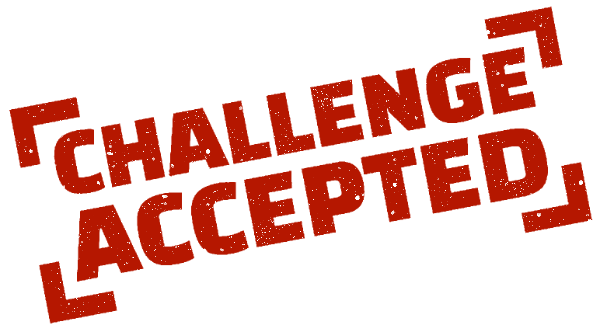

# Screen Reader Challenge

It's often hard for sighted persons to learn how to navigate and interact the web using a screen reader, so this project gamifies it to make the process a bit more fun. It also utilizes some very simple web pages with good accessibility to keep from overwhelming new users until they gain confidence.

- What if instead of “testing something”, you actually _needed_ to use a screen reader to get information?
- What if you really couldn’t see the UI?
- How would that change your perception of what a web page actually was?
- What if the fate of the world depended upon your success?

## The Challenge

You are a suave secret agent about to save the world from Boss Evil, a diabolical mastermind who is plotting to fire a rocket that will travel back in time and blow up Neil deGrasse Tyson while he’s still a grad student. This would erase him from the timeline before he’s able to influence the IAU into classifying Pluto as a dwarf planet - something Boss Evil has very strong opinions about.

After freeing yourself from Boss Evil's evil dungeon using your wristwatch laser, subduing his henchmen with your mad judo skills, and dodging his pistol fire, you knock Boss Evil unconscious with a flying spin kick. Now, all you have to do is stop the rocket launch, but... OH NO!!!

One of the bullets you dodged went right through the screen of the MacBook Pro Boss Evil was using to control the launch. The machine is somehow still running, but the screen is toast. There’s no cable or monitor nearby. Without being able to see the interface, how can you stop the rocket from launching and erasing Neil?

Remembering that all Macs come with VoiceOver built in, you hit Command-F5, crack your knuckles and hope that the Evil League of Evil makes their software with good accessibility.

Voiceover On.

<p style="margin: 0 auto;">
  <a href="https://kcox1.github.io/screenReaderChallenge/" target="_blank"
    aria-label="Visit the screen reader challenge site">
    
  </a>
</p>

## Cheat Sheet:

- `Command-F5` to start/stop Voiceover
- `control-option right arrow` move virtual cursor to next item
- `control-option left arrow` move virtual cursor to previous item
- `control-option up/down arrow` Go in/out of objects like iFrames, menus, regions
- `control-option space` activate link or form control (click)
- `control-option u` to open the Rotor
  - Use `left/right arrow` inside rotor to select panes
  - Use `up/down arrow` inside rotor to select items
  - Use `enter` inside rotor to activate selected item
  - Use `escape` to close exit rotor
- `control-option a` start reading
- `control` stop reading
- `control-option Home` Jump to top of page
- `control-option h h` Command Menu (navigate like Rotor) - allows you to find any command you don't know the key command to, or look up the key command

## 3rd Party References

- [Deque VoiceOver Keyboard Shortcuts](https://dequeuniversity.com/screenreaders/voiceover-keyboard-shortcuts#vo-mac-basics)
- [Apple VoiceOver Basics](https://www.apple.com/voiceover/info/guide/_1124.html)

## Recommended IDE Setup

[VSCode](https://code.visualstudio.com/) + [Volar](https://marketplace.visualstudio.com/items?itemName=Vue.volar) (and disable Vetur) + [TypeScript Vue Plugin (Volar)](https://marketplace.visualstudio.com/items?itemName=Vue.vscode-typescript-vue-plugin).

## Customize configuration

See [Vite Configuration Reference](https://vitejs.dev/config/).

## Project Setup

```sh
npm install
```

### Compile and Hot-Reload for Development

```sh
npm run dev
```

### Compile and Minify for Production

```sh
npm run build
```

### Lint with [ESLint](https://eslint.org/)

```sh
npm run lint
```
